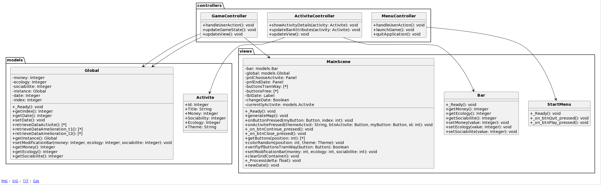

# T4

- Nom du groupe : Balaise #

 

- Membres du groupe : 
    - Wawrzyniak Maxime
    - Grethler Lucas
    - Hoogland Paolo
    - Tejeddinne K

 

- Lien vers le CDC : [Cahier des charges](https://docs.google.com/document/d/1xzDeGzwiBCh34jy6uoTakvPB755u0sSwF-H4a5tEj_0/edit#heading=h.p1l7u12dgulp)

 

- Liens vers les évaluations T4 :
  - [évaluation](./Evaluation-T4.md)
  
---
---
## Présentation du projet
---

### **Description des objectifs pédagogiques du jeu**

Re-territorialiser par la matière. Approche du métabolisme urbain à l'échelle d'un quartier. Koenigshoffen-Est à Strasbourg TW : Géographie

---
#### **Objectif pédagogique général**
 
Ce que le joueur doit apprendre, en une seule phrase la plus courte possible.

Le joueur doit être en mesure de développer des stratégies d'adaptation aux contraintes territoriales pour mettre en place une reterritorialisation par la matière, tout en prenant en compte des enjeux écologiques, sociaux et économiques, ainsi que des impacts, dans le but de favoriser un développement urbain durable à l'échelle d'un quartier.

---
#### **Description des objectifs pédagogiques**
  

##### **Traitement du territoire**
Le territoire est divisé en plusieurs districts. Ces districts se développent progressivement avec l’avancée du temps : une activité (commerciale, sociale) est née dans un district. Si son fonctionnement est réussi, elle peut s’étendre au fur et à mesure du temps à d’autres districts. Ceci crée plusieurs **hubs** qui concentrent chacun une activité.
Le territoire est alors impacté dans tous ses domaines : le nombre d’emplois, la quantité d’habitants, etc… 
On peut prendre l’exemple de Paris : anciennement, cette capitale comptait un centre-ville et sa périphérie. Suite à l’expansion du territoire, les faubourgs se sont rattachés à la ville, et des nombreux hubs se sont fondés. 

##### **Activités au seins des hubs**
Le joueur est chargé de choisir et développer une activité économique, qui sera le point focal de l’activité commerciale du quartier. Cette fonction est choisie selon les **possibilités du territoire**, c'est-à-dire les ressources disponibles sur le territoire. La reterritorialisation cherche à produire **local**, et renforcer la résilience face aux changements économiques.
 Néanmoins, l’activité doit être dynamique, et ne jamais stagner. La **perspective relationnelle** permet d’adapter et transformer l’activité pour en tirer le meilleur profit au cours du temps (ex : si une mine d’or est vidée, on adapte l’espace laissé derrière). 

Le développement de cette activité entraîne de nombreuses répercussions socio économiques :
- le développement d’une zone habitable, de communautés…
- impact écologique, pollution et décontamination…
- génération de revenus ($), investissements,  flux d’exportation…

Ces conséquences sont divisées selon les différents types d’enjeux qui composent la reterritorialisation.

---
##### **Enjeux de la reterritorialisation**
Enjeu social : 
- Création (ou rétablissement) de **sociabilités** : ce terme correspond aux échanges sociaux dans des lieux particuliers. Ces échanges sont réalisés dans des centres d’intérêts communs à ces groupes ; les groupes sont divisés selon leurs croyances, activités et puissance économique, entre autres.
- Participation citoyenne/engagement communautaire : l’implication des résidents dans la mise en œuvre de projets favorise son inclusion sociale et sentiment d’appartenance.

 

Enjeu écologique : 
- Limiter **l’impact écologique** : le développement démesuré des activités a un impact écologique très vaste. Pour le limiter, des actions peuvent être mises en place au préalable pour contrôler les niveaux de pollution. (Ex : le recyclage, les zones vertes…).
- Revitalisation de zones abandonnées/dégradées : les zones où l’activité est devenue obsolète peuvent être réaménagées. La restauration évite l’étalement excessif de l’activité, ainsi que de la pollution qui est entraînée.

 

Enjeu économique : 
- Nouvelles activités économiques : un secteur développe une activité commerciale, et plusieurs branches sont nées à partir de celle-ci. Des magasins et business qui dépendent de cette activité sont constitués. On prend l’exemple de la mine d’or, qui donne naissance à un commerce de bijoux rares, des bijouteries, des musées…
- **Résilience** de l’économie : la reterritorialisation permet de renforcer la résilience locale de l’économie face aux chocs économiques provenant des marchés extérieurs. La diversification économique qui s’enracine dans les différents hubs de la ville permet de subir tout impact extérieur, et de rester stable.

---
##### **Visualisation de l’impact**
La reterritorialisation est un phénomène qui se développe constamment au sein d’une ville. Ceci peut être constaté grâce à une **historicité** : les activités mises en place au début du cycle modifient les transformations faites au territoire.

On peut prendre l’exemple de Koenigshoffen : 

  
  
  

 
Dans ces schémas (avec 100 ans d’écart entre chacun), l’activité agricole qui a été instaurée auparavant a donné lieu à une grande quantité de zones agricoles et industrielles, ainsi que de flux de commerce. L’impact de la reterritorialisation est visible.

---
### **Description du jeu**
---
- **Type de jeu** : Gestion d’un quartier
- **Incarnation du joueur** : Le Maire de Koenigshoffen-Est

#### **Déroulement d’une partie**
Description du déroulement d’une partie : début, déroulement et fin

La partie commence avec la mise en place d’un quartier, où le joueur peut choisir une activité à instaurer. Cette activité se développe dans un district, qui correspond à une case sur la map.

Pour chaque tour, la scène avance de quelques décennies. Le joueur constatera alors les conséquences des choix réalisés au tour précédent (ex: une usine cause l’installation d’une zone habitable). Par la suite, il devra choisir une nouvelle activité à mettre en place. Les districts propres à chaque activité seront rassemblés en hubs.

Les choix impactent trois jauges différentes (économie, sociabilité, écologie). Le joueur doit gérer ses choix de développement pour gérer l’impact sur les jauges. 

Le jeu fini lorsque le nombre de tours visé est atteint, OU lorsqu’une des jauges est complètement vide. On affiche alors des images qui montrent le progrès des activités dans le quartier du joueur.

#### **Paramétrage d’une partie**
Description des options permettant de paramétrer une partie.

- Type de map : sélection entre environnement ferroviaire, maritime, routes…
- Difficulté : impacte la jauge, la génération des districts…
- Nombre de districts : taille de la map
- Nombre de tours : nombre de tours de jeu, chaque tour correspondant à une période déterminée (quelques décennies)
- Nombre de joueurs : option multijoueurs, co-op et versus

---

### **Modèle conceptuel applicatif**
Liste, MCD ou diagramme de classe décrivant le jeu, et en particulier les entités, en séparant ce qui est exposé au joueur de ce qui est interne au jeu.

### **Description des fonctionnalités**
---

#### **Actions du joueur**

Liste des actions possibles par le joueur. Peut être organisé en module.
##### **Gestion des tours**
- Valider : Valider les actions réalisées au tour et passer au tour suivant
##### **Gestion des activités**
- Choix : 
  - Sélectionner les activités à développer dans le quartier
  - Choix du district dans lequel l’activité sera instaurée

#### **Informations au joueur**
Liste des informations présentées aux joueurs. Peut-être organisé en module.

##### **Gestion des tours**
- Jauge sociale: le niveau de satisfaction des résidents dans le quartier
- Jauge écologie: le niveau de respect envers l’écologie
- Jauge économie: le niveau de puissance économique du quartier pour la ville
##### **Gestion des informations**
- Légende: sert à savoir à quoi correspondent les différentes cases.
##### **Gestion des activités**
- Choix entre plusieurs possibilités d’aménagement dans le quartier (usine, port, aéroport…)

#### **Moteur interne**
Liste des interactions entre les actions du joueur et les informations

##### **Gestion des tours**
- Suivant les choix:
  - Les différentes jauges vont être impactées (social, écologique, économique). Calcul des nouvelles jauges, addition et soustraction (selon les pourcentages définis dans notre modèle).
- Validation:	
  - Passer à la scène suivante (bond de quelques décennies). Ceci permet d’afficher l’évolution des différentes activités, son expansion à plusieurs districts et ses conséquences.

---

### **Scénarios**
---

#### **Scénario tutorial**

Décrire en détail un scénario qui s’appuie sur toutes les fonctionnalités mais sans difficulté pour le joueur.

 

Tout d’abord, le joueur doit choisir une map pour jouer sa partie. Une fois la map, les différents paramètres et la difficulté sélectionnée, la partie se lance.

Prenons l’exemple avec une map ferroviaire : 

Dans un premier temps, l**e joueur devra choisir l’activité principale à développer**. Il a le choix entre implanter une usine de voitures, une menuiserie ou une mine d’or. Ces trois options sont justifiées par la possibilité de développement industriel fourni par la ligne ferroviaire. 

  

Le choix va influer sur les jauges (écologiques, sociales, économiques). Il choisit la case (district) initiale, où l’activité naîtra. **Le joueur sélectionne la mine d’or**. Il valide son choix.

 

Par la suite, un saut temporel de plusieurs années a lieu. La map du joueur affiche alors **l’évolution de l’activité** : cette mine compte avec une expansion vers plusieurs districts (qui ensemble forment des hubs). En supplément, de nombreuses conséquences en découlent : la construction d’une mine entraîne le besoin de logement pour les travailleurs ; de même, des nouveaux services tels que la vente de bijoux sont créés…Selon chaque hub, des cases seront alors colorées, et la légende expliquera quel hub contient quelle activité. Les jauges seront aussi mises à jour.

 

> Le tour est fini. 

> Un nouveau tour commence.

 

Après avoir pris connaissance des changements, des nouveaux choix s'offrent au joueur : ouvrir un bar (enjeu social), agrandir sa mine (enjeu économique), mettre en place un centre de recyclage (enjeu écologique)…

  

**Le joueur sélectionne le centre de recyclage**. Une fois le choix validé, un saut temporel a lieu à nouveau, et la map changera à nouveau. Le centre de recyclage sera visible, la zone habitable aura grandi, ainsi que la mine. La mine grandit rapidement, et par conséquent une partie de la mine est devenue inutilisable (car elle a été trop exploitée).

 

> Le tour est fini.

>Un nouveau tour commence.

Un nouveau choix s’offre au joueur : construire un terrain de basket, agrandir sa mine ou planter des arbres sur la partie non exploitable de la mine. **Le joueur sélectionne d’agrandir la mine**. Le bond temporel est fait et le joueur rencontre à nouveau plusieurs changements (une zone habitable plus grande, une 2e bijouterie, et surtout une plus grande mine)...

 

Si les jauges sont toutes supérieures à 0 durant toute la partie, alors celle-ci est gagnée. Cependant, si uniquement des choix visant l’enjeu écologique sont faits, la partie sera perdue, car les autres jauges diminuent jusqu’à atteindre un pourcentage nul de 0%.

 

	
Une partie n’est jamais identique vu que la map évolue aléatoirement : suivant une probabilité, une mine peut s’étendre de 1 à plusieurs cases, dans tous les sens, en respectant plusieurs critères qui figurent sur le modèle. Ce calcul est aléatoire, et fait varier les choix possibles, les activités et les formes des hubs entre chaque partie.

#### **Scénarios complémentaires**
Décrire moins précisément d’autres idées de scénarios.

 

Un scénario où le joueur est obligé de respecter une seule des jauges serait une autre possibilité : les choix seraient donc plus focalisés sur une optique particulière. Par exemple, si l’objectif est d’enrichir la ville, il va choisir d’agrandir la mine encore et encore, au lieu de peser les conséquences d’une décision plutôt écologique.

 

#### **Fonctionnalités additionnelles**
Décrire ici les idées de fonctionnalités additionnelles. Cette partie ne doit servir qu’en dernier recours, pour transmettre ce qui n’a pas été inclus dans les fonctionnalités faute de temps.

 

- Annulation du développement d’une activité (ex : cessation de l’expansion d’une mine)
- Voir historique des parties précédentes : ceci permet de voir l’historicité des changements au cours de plusieurs parties. Ceci permet de voir la différence entre chaque partie, et comment chaque choix a une conséquence différente selon le territoire
- Faire des liens avec d’autres quartiers/villes (si on traite Koenigshoffen, on peut faire des liens avec Strasbourg et Montagne Verte)

--- 
---
## TODO

- [ ] 1
- [ ] 2

--- 
---
## Procédures d'installation et d'exécution

### **Windows**
Pour un bon fonctionnement du jeu, merci d'utiliser une résolution d'écran de `1920x1080` et une mise à l'échelle de 100%. 
Pour vérifier ces paramètres, allez dans `Paramètres > Système > Ecran`
- Télécharger le dossier [Windows](./Executables/Windows/)
- Lancez **Game.exe**
- Amusez-vous
---
### **Linux**
- Télécharger le dossier [Linux](./Executables/Linux/)
- Ouvrez votre terminal
- Allez dans le dossier: `cd Linux`
- Ajout des droits : `chmod u+x Game.exe.x86_64`.
- Lancez la commande : `./Game.exe.x86_64`.
- Amusez-vous !
- **/!\\** Pour un bon fonctionnement, lancez la commande `./Game.exe.x86_64` depuis le dossier où il se trouve et pas allieur. **/!\\**

---
---
## Développement
### **Pour reprendre le developpement**
Notre code source se trouve dans le dossier [Jeu](./Jeu/).
Ce dossier est un projet [GODOT 3](https://godotengine.org/download/3.x/windows/).

---
---
## Captures d'écran

 

