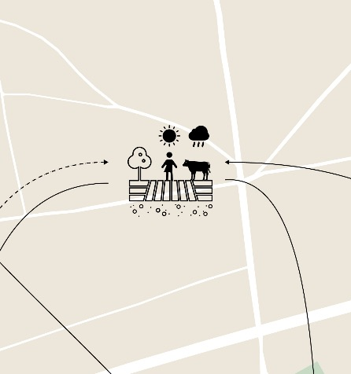
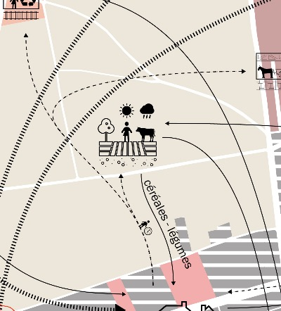
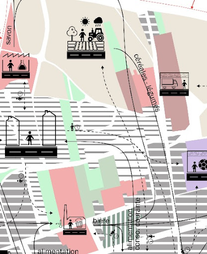
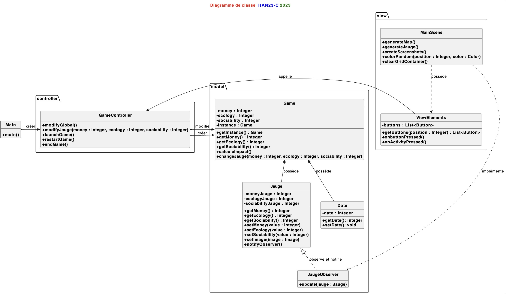
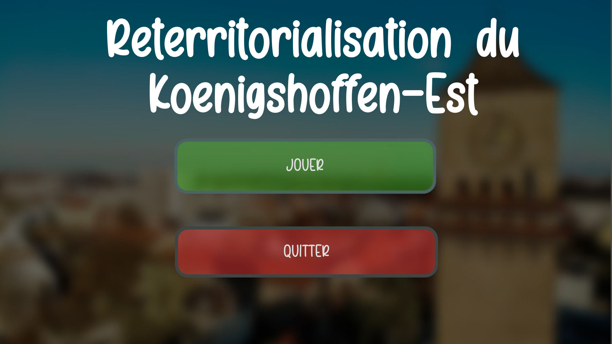
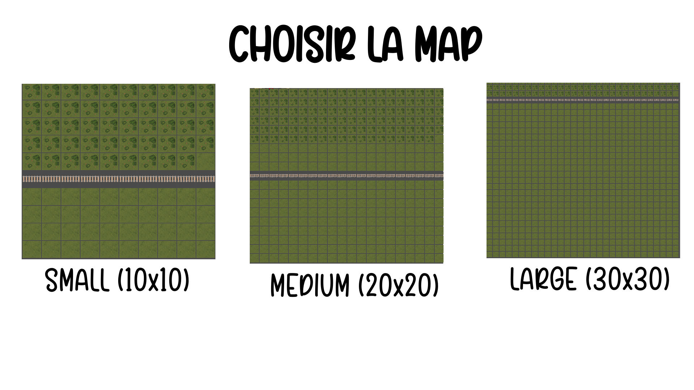
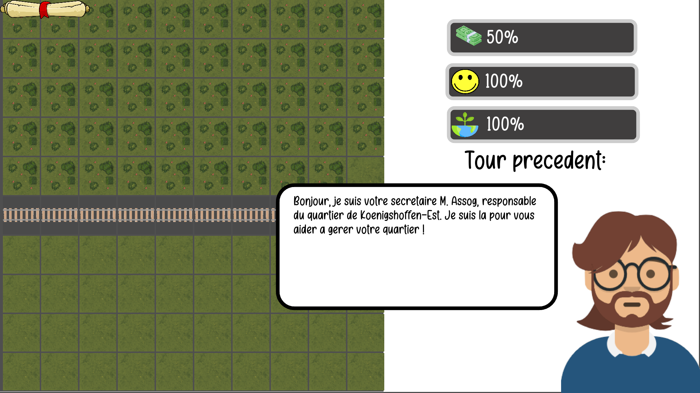
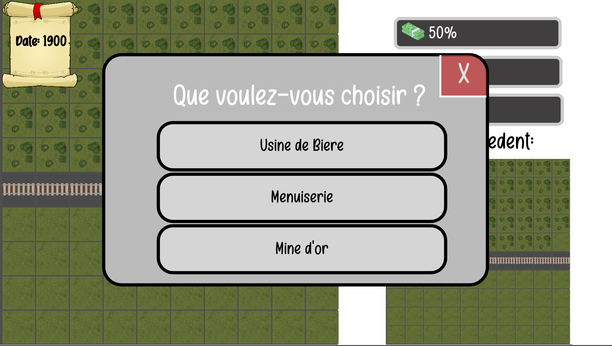
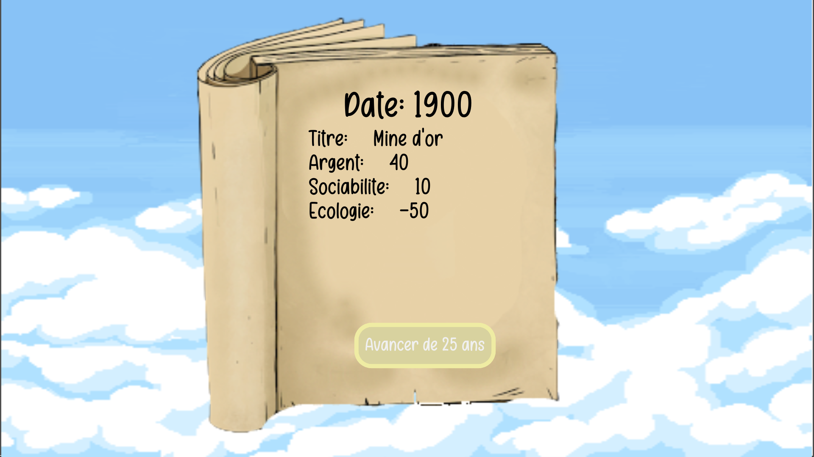
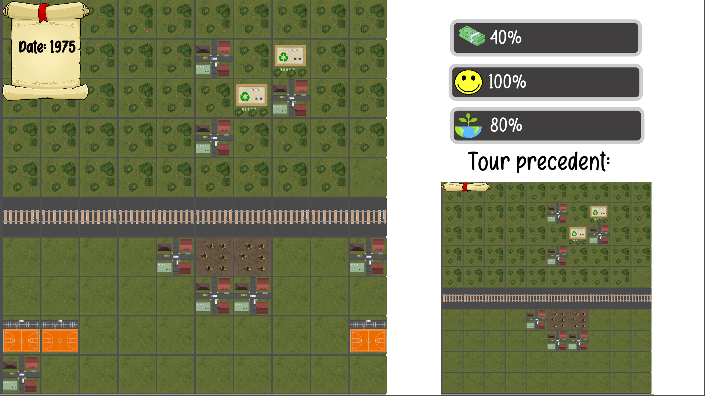

# T4

- Nom du groupe : Balaise #

 

- Membres du groupe : 
    - Wawrzyniak Maxime
    - Grethler Lucas
    - Hoogland Paolo
    - Tejeddinne K

 

- Lien vers le CDC : [Cahier des charges](https://docs.google.com/document/d/1xzDeGzwiBCh34jy6uoTakvPB755u0sSwF-H4a5tEj_0/edit#heading=h.p1l7u12dgulp)

 

- Liens vers les évaluations T4 :
  - [évaluation](./Evaluation-T4.md)
  
---
---
## Présentation du projet
---

### **Description des objectifs pédagogiques du jeu**

Re-territorialiser par la matière. Approche du métabolisme urbain à l'échelle d'un quartier. Koenigshoffen-Est à Strasbourg TW : Géographie

---
#### **Objectif pédagogique général**
 
Ce que le joueur doit apprendre, en une seule phrase la plus courte possible.

Le joueur doit être en mesure de développer des stratégies d'adaptation aux contraintes territoriales pour mettre en place une reterritorialisation par la matière, tout en prenant en compte des enjeux écologiques, sociaux et économiques, ainsi que des impacts, dans le but de favoriser un développement urbain durable à l'échelle d'un quartier.

---
#### **Description des objectifs pédagogiques**
  

#### **Définitions**
La **reterritorialisation** correspond au processus par lequel les personnes renforcent leur lien et contrôle sur le territoire. Celui-ci subit des changements à cause des nombreuses activités, fragmentées sur toute sa surface. Les changements sont de type social, économique et écologique. 

En outre, elle **permet aux individus de profiter du territoire et adapter de nombreuses activités économiques selon les possibilités disponibles ; par la suite, le développement de ces activités entraîne des enjeux socio-économiques qui vont impacter l'environnement.** Ces activités s'étalent à partir de sa création en fonction de sa **rentabilité** et les **ressources** disponibles.

La reterritorialisation sera représentée par l’étude du quartier Est du Koenigshoffen, qui se voit pourvu d’une nouvelle ligne ferroviaire (et une gare) passant par un territoire vide et exploitable.

##### **Traitement du territoire**
Le territoire est divisé en plusieurs districts. Ces districts se développent progressivement avec l’avancée du temps : en un premier temps, le territoire est vide. L’inauguration de la gare permet aux acteurs de développer une première activité.

Cette activité est née dans un district. Elle utilise les ressources disponibles pour créer un produit. La liste exhaustive d’activités économiques possibles est la suivante: 
- tout type d’usine (alimentaire, textile, transport, électronique) : possible si de la matière première est disponible
- mine d’or : possible si des caves sont exploitables
- menuiserie : possible si une source de bois proche est exploitable
- port, moulins : possible si une source d’eau exploitable est proche
- agriculture, élevage : possible si le sol et les animaux sont exploitables
- gare, lignes ferroviaires (déjà instaurée au Koenigshoffen) : possible si un espace ouvert est exploitable

Si son fonctionnement est réussi, cette activité peut s’étendre au fur et à mesure du temps à d’autres districts. Ceci crée plusieurs hubs qui concentrent chacun une activité. Le territoire est alors impacté dans tous ses domaines : le nombre d’emplois, la quantité d’habitants, le niveau de pollution, le revenu total.
On peut prendre l’exemple de Paris : anciennement, cette capitale comptait un centre-ville et sa périphérie. Suite à l’expansion des activités commerciales du centre-ville, les faubourgs se sont rattachés à la ville, et de nombreux hubs se sont fondés. 

##### **Activités au seins des hubs**
Le joueur est chargé de choisir et développer une (ou plusieurs) activité(s) économique(s). Ces fonctions sont choisies selon les possibilités du territoire, c'est-à-dire les ressources disponibles sur le territoire. La reterritorialisation cherche à produire local, et renforcer la résilience face aux changements économiques.
 Néanmoins, l’activité doit être dynamique, et ne jamais stagner. La perspective relationnelle permet d’adapter et transformer l’activité pour en tirer le meilleur profit au cours du temps. Si une activité devient obsolète et/ou ne peut plus être développée, une action peut être exercée sur la zone de cette activité ; de cette façon, l’activité globale est ajustée reste dynamique.

Le développement de cette activité entraîne de nombreuses répercussions socio économiques :  
+ Économiques
- génération de revenus ($)
- nouveaux commerces
- investissements locaux/externes
- flux d’exportation/importation  
+ Sociales : 	
- le développement d’une zone habitable
- le développement de communautés
- zones de loisirs
- associations de résidents

+ Écologiques 	
- niveau moyen/élevé de pollution (zone industrielle)
- actions de décontamination/prévention

La reterritorialisation est composée de différents types d’enjeux, qui s'étendent dans plusieurs domaines. 

---
##### **Enjeux de la reterritorialisation**
Enjeu social : 
- Création (ou rétablissement) de **sociabilités** : ce terme correspond aux échanges sociaux dans des lieux particuliers. Ces échanges sont réalisés dans des centres d’intérêts communs à ces groupes ; les groupes sont divisés selon leurs croyances, activités et puissance économique, entre autres.
- Participation citoyenne/engagement communautaire : l’implication des résidents dans la mise en œuvre de projets favorise son inclusion sociale et sentiment d’appartenance.

 

Enjeu écologique : 
- Limiter **l’impact écologique** : le développement démesuré des activités a un impact écologique très vaste. Pour le limiter, des actions peuvent être mises en place au préalable pour contrôler les niveaux de pollution. (Ex : le recyclage, les zones vertes…).
- Revitalisation de zones abandonnées/dégradées : les zones où l’activité est devenue obsolète peuvent être réaménagées. La restauration évite l’étalement excessif de l’activité, ainsi que de la pollution qui est entraînée.

 

Enjeu économique : 
- Nouvelles activités économiques : un secteur développe une activité commerciale, et plusieurs branches sont nées à partir de celle-ci. Des magasins et business qui dépendent de cette activité sont constitués. On prend l’exemple de la mine d’or, qui donne naissance à un commerce de bijoux rares, des bijouteries, des musées…
- **Résilience de l’économie** : la reterritorialisation permet de renforcer la résilience locale de l’économie face aux chocs économiques provenant des marchés extérieurs. La diversification économique qui s’enracine dans les différents hubs de la ville permet de subir tout impact extérieur, et de rester stable.

---
##### **Visualisation de l’impact**
La reterritorialisation est un phénomène qui se développe constamment au sein d’une ville. Ceci peut être constaté grâce à une **historicité** : les activités mises en place au début du cycle modifient les transformations faites au territoire.

On peut prendre l’exemple de Koenigshoffen : 

  
  
  

 
Dans ces schémas (avec 100 ans d’écart entre chacun), l’activité agricole qui a été instaurée auparavant a donné lieu à une grande quantité de zones agricoles et industrielles, ainsi que de flux de commerce. L’impact de la reterritorialisation est visible.

 

On peut décrire l’effet d’un choix de développement comme “aléatoire” : il pourra s’étendre et agrandir grandement, moyennement ou à courte échelle. Cependant, ceci n’est pas prévisible au préalable. Si l’activité est rentable, elle continuera à grandir ; elle pourra aussi devenir obsolète ou diminuer son profit. L’historicité permet d’étudier ces facteurs, et en tirer un avantage pour les prochains choix.

---
### **Description du jeu**
---
- **Type de jeu** : Gestion d’un quartier
- **Incarnation du joueur** : Le Maire de Koenigshoffen-Est

#### **Déroulement d’une partie**
Description du déroulement d’une partie : début, déroulement et fin

La partie commence avec la mise en place d’un quartier, où le joueur peut choisir une activité à instaurer. Cette activité se développe dans un district, qui correspond à une case sur la map.

Pour chaque tour, la scène avance de 25 ans. Le joueur constatera alors le développement des choix réalisés au tour précédent : l’activité qui a été choisie s’étend sur le territoire et implante ses besoins dans plusieurs districts (ces besoins diffèrent selon chaque activité, et seront traités concrètement au long du document). 
 Par la suite, il devra choisir une nouvelle activité à mettre en place. Les activités en expansion seront rassemblées en hubs. Les choix impactent (de même) trois jauges différentes (économie, sociabilité, écologie). Le joueur doit gérer ses choix de développement pour contrôler l’impact sur les jauges. 

Le jeu fini lorsque le nombre de tours visé est atteint, OU lorsqu’une des jauges est complètement vide. On affiche alors des images qui montrent le progrès des activités dans le quartier du joueur.

#### **Paramétrage d’une partie**
Description des options permettant de paramétrer une partie.

- Type de map : sélection entre environnement ferroviaire, maritime ou routier
- Difficulté : impacte la jauge et la génération des districts
- Saison : chaque saison impacte de façon différente l’activité
- Nombre de districts : taille de la map
- Nombre de tours : nombre de tours de jeu, chaque tour correspondant à une période déterminée (dans ce cas : 25 ans)
- Nombre de joueurs : option multijoueurs (co-op et versus)

---

### **Modèle conceptuel applicatif**
Liste, MCD ou diagramme de classe décrivant le jeu, et en particulier les entités, en séparant ce qui est exposé au joueur de ce qui est interne au jeu.

### **Description des fonctionnalités**
---

### **Actions du joueur**

Liste des actions possibles par le joueur. Peut être organisé en module.

##### **Gestion des activités**
Sélection des activités à développer dans un district du quartier. On compte avec la liste exhaustive suivante : 
+ Nouvelles activités économiques (ainsi que l’option d’étendre cette activité) : 
- tout type d’usine (alimentaire, textile, automobile, électronique)
- mine d’or
- menuiserie
- port
- agriculture, pâturage
- moulin

+ Activités écologiques : 
- centre de recyclage
- déchetterie
- centre de compostage
- jardins communautaires
- plantation d’arbres

+ Activités sociales : 
- bibliothèque
- centre commercial/shopping center
- bars/restaurants
- salles de sport
- centre culturel

##### **Gestion des tours**
- Valider : Valider les actions réalisées au tour et passer au tour suivant

### **Informations au joueur**
Liste des informations présentées aux joueurs. Peut-être organisé en module.

##### **Gestion des tours**
Jauge sociale: le niveau de satisfaction des résidents dans le quartier
Jauge écologie: le niveau de respect envers l’écologie
Jauge économie: le niveau de puissance économique du quartier pour la ville

La jauge a comme unité des pourcentages. 
Ici la liste exhaustive des calculs réalisés selon les choix possibles de l’utilisateur : 
+ Activités économiques :
- Mine d’or [Social : +0% ; Écologie : -50% ; Économie : +70%]
- Usine automobile [Social : +20% ; Écologie : -30% ; Économie : +50%]
- Usine électronique [Social : +20% ; Écologie : -30% ; Économie : +50%]
- Usine alimentaire [Social : +20% ; Écologie : -30% ; Économie : +50%]
- Usine automobile [Social : +20% ; Écologie : -30% ; Économie : +50%]
- Port [Social : +20% ; Écologie : -20% ; Économie : +40%]
- Menuiserie [Social : +15% ; Écologie : -10% ; Économie : +30%]
- Agriculture [Social : +10% ; Écologie : -10% ; Économie : +30%]
- Moulins [Social : +10% ; Écologie : -5% ; Économie : +15%]

+ L’extension de toute activité compte par défaut avec les pourcentages suivants : 
- Extension [Social : +5% ; Écologie : -15% ; Économie : +30%]

+ Activités écologiques : 
- Centre de recyclage [Social : -10% ; Écologie : +40% ; Économie : +5%]
- Déchetterie [Social : +20% ; Écologie : +30% ; Économie : +5%]
- Centre de compostage [Social : -10% ; Écologie : +30% ; Économie : -20%]
- Jardins communautaires [Social : +20% ; Écologie : +30% ; Économie : -30%]
- Plantation d’arbres [Social : +5% ; Écologie : +20% ; Économie : -15%]

+ Activités sociales : 
- Bars/restaurants [Social : +30% ; Écologie : -20% ; Économie : +5%]
- Bibliothèque [Social : +20% ; Écologie : -10% ; Économie : -20%]
- Shopping center [Social : +20% ; Écologie : -30% ; Économie : +10%]
- Salles de sport [Social : +20% ; Écologie : -30% ; Économie : +50%]
- Centre culturel [Social : +15% ; Écologie : -10% ; Économie : -15%]

À la fin du tour, les activités validés évoluent et s’élargissent vers d’autres districts. Le joueur verra la nouvelle map, et pourra faire des nouveaux choix (en fonction des choix précédents). Le fonctionnement derrière ce point sera expliqué plus tard (voir [Moteur interne](#moteur-interne))

##### **Gestion des informations**
- Légende: sert à savoir à quoi correspondent les différentes cases. Elle sera vue de forme de pop-up, et sera affichée en survolant les cases. Si la case est vide, elle ne montrera aucune information ; sinon, elle explicite le type d’activité qui se déroule au sein du hub.
- Narrateur : le secrétaire du maire, M. Assog, aide le joueur à comprendre ses objectifs ; à travers des pop-ups, il explique les actions possibles ainsi que ses conséquences.

#### **Gestion de l'historicité**
- Screenshots des tours précédents : comme vu auparavant, l’historicité permet de comprendre l’impact de la reterritorialisation. Des screenshots permettent de consulter les choix des tours précédents. Ces photos montrent l’évolution des choix, ses conséquences, ainsi que l’adaptation des stratégies au territoire.

### **Moteur interne**
Liste des interactions entre les actions du joueur et les informations

##### **Gestion des tours**
- Impact des jauges (social, écologique, économique) : on calcule (addition et soustraction) l’impact du choix du joueur sur les jauges (selon les pourcentages déjà définis dans notre modèle).
- Passer à la scène suivante (saut temporel) : Ceci permet d’afficher l’évolution des différentes activités, son expansion à plusieurs districts et ses conséquences. Visuellement, cette évolution est traduite par un étalement de la portée d’une activité (c’est-à-dire les cases propres à chaque activité) qu’on appellera “probabilité d’étalement”

Le calcul sera fait selon l’activité choisie : 

+ Activités économiques  :
- Mine d’or : probabilité de 0 à 2 cases par tour 
- Usine automobile : probabilité de 1 à 3 cases par tour
- Usine électronique : probabilité de 1 à 3 cases par tour
- Usine alimentaire : probabilité de 1 à 3 cases par tour
- Usine automobile : probabilité de 1 à 3 cases par tour
- Port : probabilité de 0 à 2 cases par tour
- Menuiserie : probabilité de 1 à 2 cases par tour
- Agriculture : probabilité de 1 à 4 cases par tour
- Moulins : probabilité de 0 à 2 cases par tour

+ L’extension de toute activité compte par défaut avec les probabilités suivantes : 
- Extension : probabilité de 0 à 3 cases par tour

+ Activités écologiques : 
- Centre de recyclage : probabilité de 0 à 2 cases par tour
- Déchetterie : probabilité de 0 à 1 cases par tour
- Centre de compostage : probabilité de 0 à 1 cases par tour
- Jardins communautaires : probabilité de 1 à 3 cases par tour
- Plantation d’arbres : probabilité de 0 à 2 cases par tour

+ Activités sociales : 
- Bars/restaurants : probabilité de 1 à 2 cases par tour
- Bibliothèque : probabilité de 0 à 1 cases par tour
- Shopping center : probabilité de 1 à 3 cases par tour
- Salles de sport : probabilité de 0 à 1 cases par tour
- Centre culturel : probabilité de 1 à 2 cases par tour

##### **Gestion des tours (pt.2)**
Besoins nécessaires pour une activité : après avoir cliqué sur une activité, celle-ci compte avec des besoins pour se développer. Pour se développer et s’étaler, les activités ont besoin de fournisseurs (dans notre cas : fournisseurs de ressources, d’outils et de matériaux) ainsi que des services qui gèrent son développement.

Ces éléments seront listés ci-dessous : 

+ Activités économiques  :
- Mine d’or : 
  - fournisseur d’outils, de machines pour creuser la terre
  - centrale électrique
  - experts souterrains
- Usine alimentaire : 
  - fournisseur de glace (bière), de matière première (aliments, graines)
  - centrale électrique
mécaniciens
- Usine automobile/électronique/automobile ou port : 
  - fournisseurs de matériaux processés (dérivés du métal)
  - centrale électrique
  - mécaniciens
- Menuiserie :
  - fournisseur de bois
  - fournisseur d’outils, de machines
  - mécaniciens
- Agriculture/Ferme/Moulins : 
  - terrain pour cultures/élevage/construction
  - outils (engrais, aliment pour animaux)
  - machines et outils (faux, tracteurs)

Les éléments listés sont les besoins essentiels des activités?
Les activités sociales et écologiques sont choisies par le joueur.

---

### **Scénarios**
---

#### **Scénario tutorial**

Décrire en détail un scénario qui s’appuie sur toutes les fonctionnalités mais sans difficulté pour le joueur.

 

Tout d’abord, le joueur doit choisir une map pour jouer sa partie. La map est constituée de cases où le joueur peut interagir avec. Il existe 3 types de map : Petite (10 x 10 cases), Moyen (20 x 20 cases) ou Grand (30 x 30 cases). Il pourra de même choisir la saison (Hiver, Été, Automne ou Printemps). Une fois la map choisie, ainsi que les différents paramètres et la difficulté sélectionnée, la partie se lance.

On étudie le quartier du Koenigshoffen, territoire impacté par l’implantation d’une ligne ferroviaire : 

  

> Le premier tour commence.

 

Dans un premier temps, le joueur devra choisir l’activité principale à développer. Il a le choix entre implanter une usine à bière, une menuiserie ou une mine d’or. Ces trois options sont justifiées par la possibilité de développement industriel fourni par la ligne ferroviaire.

 

Le choix va influer sur les jauges (écologiques, sociales, économiques). Elles sont toutes initialisées à 50% : [Social : 50% ; Écologie : 50% ; Économie : 50%]. Il choisit la case (district) initiale pour implanter une activité. Le joueur sélectionne l’usine à bière. Il valide son choix.

 
Par la suite, un saut temporel de 25 ans a lieu. La map du joueur affiche alors l’évolution de l’activité : l’usine s’étend naturellement, et au cours de 25 ans elle vit une expansion vers plusieurs districts. Cette quantité est aléatoire : dans ce cas, l’usine à bière passe d’une case à trois cases. Les trois districts industriels forment alors un hub industriel.

 

En supplément, de nombreuses conséquences en découlent : 
- Une usine de bière a besoin d’un fournisseur de graines (orge et blé), de glace et d’électricité. Tous ces éléments apparaîtront sur la map, avec ses propres districts.
- La construction de l’usine entraîne le besoin de logement pour les travailleurs. Des zones habitables seront aussi développées sur la map.
- Les jauges seront aussi mises à jour. Le jeu calcule les nouvelles valeurs de chaque jauge (valeur finale : [Social : 70% ; Écologie : 20% ; Économie : 90%])

> Le tour est fini. 

> Un nouveau tour commence.

 
Après avoir pris connaissance des changements, des nouveaux choix s'offrent au joueur : ouvrir un bar (enjeu social), agrandir sa mine (enjeu économique) ou mettre en place un centre de recyclage (enjeu écologique).

 
Le joueur cherche à faire beaucoup plus d’argent et sélectionne l’installation d’une mine d’or. Une fois le choix validé, un saut temporel a lieu, et la map change à nouveau. Le centre de recyclage sera visible (1 case), la zone habitable aura grandi (de 2 cases), ainsi que la nouvelle mine (de 3 cases). Cette dernière grandit rapidement. Les jauges seront calculées (valeur finale : [Social : 80% ; Écologie : 0% ; Économie : 100%]).

 

> Le tour est fini.

> Cependant, une des jauges est complètement vidée : Écologie 0%. Le joueur perd la partie, vu qu’il n’a pas su gérer les jauges, et doit recommencer.

 
 

#### **Fonctionnalités additionnelles**
Un scénario où le joueur est obligé de respecter une seule des jauges serait une autre possibilité : les choix seraient donc plus focalisés sur une optique particulière. Si l’objectif est d’enrichir la ville, il va choisir d’agrandir la mine encore et encore, au lieu de peser les conséquences d’une décision plutôt écologique.

 
#### **Fonctionnalités additionnelles**

 - Annulation du développement d’une activité : si une activité a été développée et le joueur ne veut plus son extension, il pourra l’annuler. 
On fait référence à toutes les activités économiques listées auparavant.
- Voir historique des parties précédentes : ceci permet de voir l’historicité des changements au cours de plusieurs parties. Ceci permet de voir la différence entre chaque partie, et comment chaque choix a une conséquence différente selon le territoire.
- Faire des liens avec d’autres quartiers/villes (si on traite Koenigshoffen, on peut faire des liens avec Strasbourg et Montagne Verte).
- Ajout de contraintes géographiques sur le territoire (vallées, caves, montagnes, mer).
- Événements historiques tels que les guerres mondiales ou les crises économiques impactent l’étalée des activités.

--- 
---
## TODO

- [ ] 1
- [ ] 2

--- 
---
## Procédures d'installation et d'exécution

### **Windows**
Pour un bon fonctionnement du jeu, merci d'utiliser une résolution d'écran de `1920x1080` et une mise à l'échelle de 100%. 
Pour vérifier ces paramètres, allez dans `Paramètres > Système > Ecran`
- Télécharger le dossier [Windows](./Executables/Windows/)
- Lancez **Game.exe**
- Amusez-vous
---
### **Linux**
- Télécharger le dossier [Linux](./Executables/Linux/)
- Ouvrez votre terminal
- Allez dans le dossier: `cd Linux`
- Ajout des droits : `chmod u+x Game.exe.x86_64`.
- Lancez la commande : `./Game.exe.x86_64`.
- Amusez-vous !
- **/!\\** Pour un bon fonctionnement, lancez la commande `./Game.exe.x86_64` depuis le dossier où il se trouve et pas allieur. **/!\\**

---
---
## Développement
### **Pour reprendre le developpement**
Notre code source se trouve dans le dossier [Jeu](./Jeu/).
Ce dossier est un projet [GODOT 3](https://godotengine.org/download/3.x/windows/).

---
---
## Captures d'écran

 

